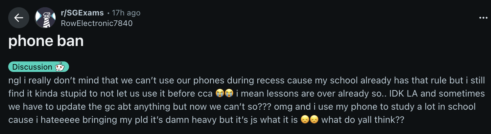

# The Phone Ban Meltdown

It's January 2026. Your child has just barely survived the first week of school. But instead of talking about their new form teacher or their CCA schedule, the dinner table conversation—and the *r/SGExams* subreddit—is dominated by one explosive topic: **The 2026 Phone Ban.**

I have quite close ties with my students, and I'm on reddit. From what I'm seeing, friends among schools are comparing, and the narrative is furious:

* *"It’s draconian."*
* *"It’s a safety hazard—what if there’s an emergency?"*
* *"They are treating us like prisoners."*
* *"We have a right to relax during recess."*
* *"Why does ___ school do ____ but my school does ____ ?"*

The students seem to be framing this new year's resolution by the Ministry as a **civil liberty issue**. They are debating the logic of the rule, pointing out the inefficiencies ("Teachers using walkie-talkies is stupid"), and arguing that they are being "oppressed" by an out-of-touch system.

### **The "Oppression" is Actually Withdrawal**

When a student screams that the school is "taking away their freedom," it is rarely about the logistics of the pickup gate. It is a physiological panic response.

As someone who has personally battled the urge to doom-scroll (and lost many times), I recognize the symptoms. But because our teens are articulate and intelligent, they mask these symptoms with logical arguments. They turn into **Angry Lawyers** with the following arguments:

**1. The Argument:** *"This is pointless. I use my phone to decompress. Now I’ll just be stressed all day."*
**The Reality: Addiction.**
They aren't actually "decompressing" on TikTok; they are numbing. Their brains have become dependent on the high-speed loop of *scroll-reward-scroll-reward*. When you sever that loop, the brain doesn't just feel "bored"—it feels a drop in "feel-good chemicals" that manifests as irritability and rage. They feel "oppressed" because their brain is screaming for a fix.

**2. The Argument:** *"It’s a safety issue. What if the bus is late? What if I need you?"*
**The Reality: Loss of Control.**
For this generation, the phone is a remote control for their reality. They can summon food, transport, and entertainment instantly. Taking the phone away forces them to surrender to the uncertainty of the physical world. That loss of agency feels terrifying, so they frame it as a "safety" risk to make it sound rational.

**3. The Argument:** *"The school doesn't trust us. They are treating us like babies."*
**The Reality: Social Exposure.**
This is the hardest one. Without a phone, a student standing alone in the canteen looks "lonely." With a phone, they look "busy." The ban strips away their social armor. They feel naked and exposed to the judgment of their peers. It is easier to be angry at the "tyrannical school" than to admit, *"I don't know how to look people in the eye for 30 minutes straight."*

The trickiest part of implementing such a phone ban: **Some parents might be angry too.**

### **The Parent’s Dilemma: When the Logistics Fail**

Let’s be honest—the rollout hasn't been smooth with all schools. I saw a comment from a frustrated Sec 1 parent recently that resonated with many:

> *"I just wanted to know what time they are dismissed today, because the school didn't send this out in a letter... Maybe parents go to pick up their child but the child cannot be found because they are at the wrong gate."*

This is a valid frustration. The ban has exposed just how much we relied on that instant response.

* **The Pickup Panic:** You’re at Gate B. They are at Gate A. Usually, a quick WhatsApp fixes this. Now? It’s a 20-minute panic.
* **The Schedule Black Hole:** Tuition teachers are waiting, employers of part-time students are confused, and parents are left guessing if dismissal is at 1:30 PM or 2:30 PM.
* **The "Wasted Time":** We hear stories of teachers spending 15 minutes of curriculum time acting as "Phone Police," or the front office being overwhelmed with students asking to call home.

It is tempting, in the heat of this logistical mess, to look at your angry child and say, *"You know what? You're right. This IS stupid. The school is disorganized."*

**Don't do it.**

### **The Trap: Don't Confuse Logistics with Policy**

This is the most critical moment for parents. There is a massive difference between **Bad Administration** (not sending a dismissal circular) and **Good Pedagogy** (enforcing lesser screen time).

If you join your child in bashing the ban because *you* are inconvenienced, you inadvertently validate their addiction. You give them the green light to believe that their withdrawal symptoms are actually a righteous fight against incompetence.

We need to separate the two issues.

1. **The School's Comms:** Needs to improve. (And it will, as they adjust).
2. **The Student's Withdrawal:** Needs to happen.

### **How to Handle the Chaos at Home**

We need to solve the logistical nightmare *without* undermining the digital detox. Here is your game plan.

**1. Validate the Mess, Not the Narrative**
When your teen complains that the system is messy, agree with them.

* **Say:** *"You are right. It is annoying that I didn't know when to pick you up. The school needs to communicate better."*
* **But add:** *"But that doesn't mean the phone ban is wrong. It just means we need a better plan."*

**2. The "Analog Protocol" (Your New Best Friend)**
We survived school before smartphones; we can do it again. But it requires **pre-planning**, something the digital age made us lazy about.

* **The "Gate A" Rule:** Establish a fixed pickup spot. "If I am not there, wait 15 minutes, then go to the General Office." No WhatsApp required.
* **The Wristwatch:** If they don't have one, get a simple wristwatch today. Eliminate the "I need to check the time" excuse.
* **The Hard Copy Schedule:** Print their timetable. Print the tuition schedule. Tape it to their file. In fact, we used to be able to remember our schedule for the day. We can't let the over-reliance on digital devices erode our memory capabilities.

**3. Call Out the "Phantom Itch" (Gently)**
Wait for a calm moment. Share your own struggle.

* **Say:** *"You know, when I leave my phone in the other room, I sometimes feel this physical panic. Like I’m missing something vital. And I always seem to have a reason to need my phone. But if you truly ask yourself - is there an alternative to what you "need" to do that doesn't involve a smart phone? You'll see that a smartphone in most instances is not that important."*

### **Pre-empting the Monday Meltdown: A 10-Minute Weekend Strategy**

If the first few days of school were chaotic, do not send them back into the trenches on Monday without a plan. Use this weekend to "debug" the system.

Sit down with your teen for 10 minutes—not to lecture, but to strategize. Treat it like a mission briefing.

* **The "What If" Simulation:** Anxiety comes from the unknown. Pre-empt the panic by roleplaying the scenarios that scared them this week. *"If CCA ends early, where do you go?"* (Answer: The library or the canteen, not the void deck).
* **Load the "Pocket DLC":** If they felt awkward standing alone in the canteen, solve that problem physically. Pack a "dumb" entertainment tool in their bag—a small novel, a deck of Uno cards (great for social baiting), or even a printed Sudoku book. Give them something to hold so they don't feel "naked" without their phone.
* **The "Digital Sunset":** The hardest part of the ban is the contrast. If they go from 0 hours of phone use at school to 6 hours of binge-scrolling at home, the withdrawal next morning will be brutal. Agree on using Sunday night to help taper down their phone usage. 

### **The Bottom Line**

The first month of 2026 is going to be loud. The logistics *will* be messy. Parents might get annoyed when inconveniences arise.

But don't let the administrative hiccups fool you. This isn't a civil rights movement. It’s the sound of a generation’s withdrawal symptom. It will be painful, and they will blame everyone but the device.

Stand firm. Be empathetic to their pain, but don't buy their arguments about oppression. They will survive the tyranny of a screen-free recess—and they might even find themselves (and each other) in the process.